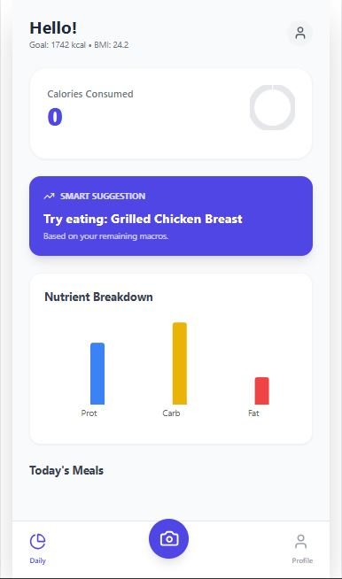
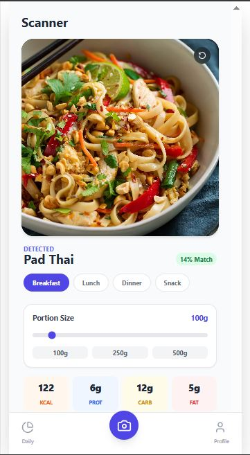
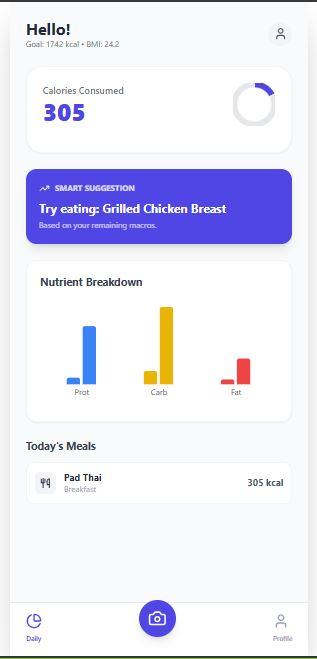

# 🥗 CalorieCounter: AI-Powered Food Recognition & Nutrition Analysis


---

## 📌 Overview

**CalorieCounter** is an AI-powered Android application designed to automate food logging and calorie estimation using **computer vision** and **deep learning**. Users can simply take a photo of their meal, and the system automatically detects food items, estimates portion sizes, and generates a detailed nutritional breakdown.

Manual calorie tracking is often tedious, time-consuming, and error-prone. CalorieCounter addresses this issue by eliminating manual input and providing **instant, accurate, and user-friendly nutritional insights**.

---

## 🎯 Objectives

- Automate calorie and macronutrient tracking from food images.
- Reduce human error in dietary logging.
- Support healthier eating habits through data-driven insights.
- Increase user engagement via gamification and progress tracking.

---

## 📱 Application Screenshots

| Dashboard & Streaks | AI Food Detection | Nutritional Report | Profile Page |
|:---:|:---:|:---:|:---:|
|  |  |  |  |
| Daily goals & streaks | Multi-item detection | Calories & macros | User profile |

---

## 🚀 Key Features

- **📸 Snap & Track** Detect food items from a single image using CNN-based models.

- **🍽️ Multi-Item Food Detection** Identifies multiple food items present on a single plate.

- **📏 Portion Size Estimation** Estimates food volume using visual context and scaling heuristics.

- **📊 Nutritional Analysis** Calculates calories, protein, carbohydrates, and fats per meal.

- **🚫 Dietary & Allergen Flags** Flags food items based on dietary preferences (Vegan, Keto, etc.).

- **🏆 Gamification System** Streaks, badges, and progress tracking to encourage consistency.

---

## 🧠 System Architecture & AI Pipeline

The application follows a **four-stage AI processing pipeline**:

1. **Image Acquisition** The user captures a food image using the mobile camera.

2. **Food Recognition** The image is processed by a **Convolutional Neural Network (CNN)** trained using **transfer learning** to classify food items.

3. **Portion Estimation** Visual cues and contextual information are used to estimate serving sizes.

4. **Nutritional Mapping** Detected food items are mapped to a nutrition database to compute calories and macronutrients.

---

## 🏗️ Tech Stack

### Mobile Application
- **Language:** Kotlin / Java
- **IDE:** Android Studio
- **UI:** Material Design Components

### Machine Learning
- **Frameworks:** TensorFlow / PyTorch
- **Models:** Convolutional Neural Networks (CNNs), Transfer Learning

### Backend & Data
- **Language:** Python / Node.js (Optional)
- **Database:** Firebase Firestore / SQL
- **Data Source:** Nutrition dataset (USDA or custom curated dataset)

---

## 📊 Dataset & Model Training

- Public food image datasets combined with custom-collected samples.
- Data augmentation applied for improved generalization.
- Pretrained CNN architectures fine-tuned for food classification.
- **Evaluation Metrics:** Accuracy, Precision, Recall.

---

## ⚙️ Installation & Setup

### Prerequisites
- Android Studio (Latest Version)
- Android device with camera capability
- Gradle

### Steps

1. **Clone the repository:**
   ```bash
   git clone https://github.com/Prithvi1101/CalorieCounter-AI.git
   ```

2. **Open the project:**
   Launch Android Studio and select "Open an Existing Project", pointing to the cloned folder.

3. **Sync Dependencies:**
   Let Gradle sync and download the necessary libraries.

4. **Run the App:**
   Connect a physical device via USB or use an Emulator to build and run the application.

---


## 📄 License

This project is licensed under the MIT License.
See the [LICENSE](LICENSE) file for more details.

---

## ⭐ Acknowledgements

- TensorFlow & PyTorch communities
- Open-source food image datasets (Food-101, etc.)
- Android developer community

---
